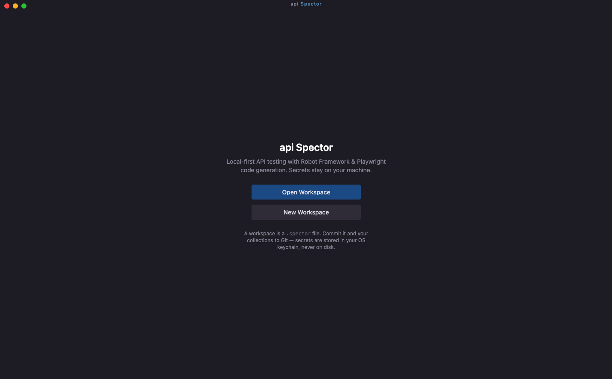

# Installation

API Spector is distributed as an npm package. It includes both a desktop GUI (Electron) and a CLI for running tests and mock servers headlessly.

## Requirements

- Node.js 18 or higher
- npm 9 or higher

## Install globally

```bash
npm install -g @testsmith/api-spector
```

Verify the installation:

```bash
api-spector --help
```

Expected output:

```
  API Spector — local-first API testing tool

  Usage:
    api-spector ui                            Launch the app
    api-spector run  --workspace <path>       Run tests from CLI
    api-spector mock --workspace <path>       Start mock servers from CLI

  Options:
    api-spector run  --help                   Show run options
    api-spector mock --help                   Show mock options
```

## Launch the UI

```bash
api-spector ui
```



On first launch you will see the welcome screen with two options:
- **Open Workspace:** open an existing `.spector` workspace file
- **New Workspace:** create a new workspace and choose where to save it

## Update

```bash
npm update -g @testsmith/api-spector
```

## Uninstall

```bash
npm uninstall -g @testsmith/api-spector
```
