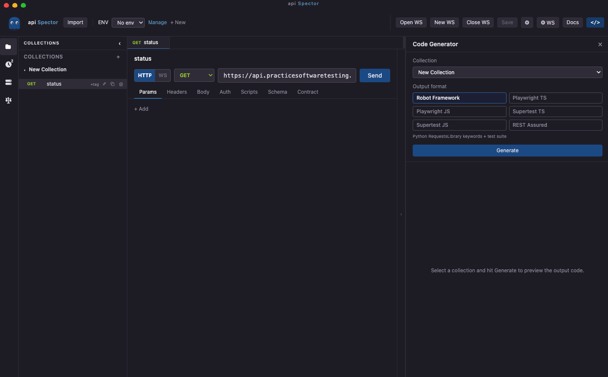

# Export to Code

API Spector can generate test code from a collection for several frameworks.

## Open the code generator

Click the **</>** button in the top toolbar to open the code generator panel.

## Available targets

| Target | Language | Framework |
|---|---|---|
| Robot Framework | Python | RequestsLibrary keyword-driven test suite |
| Playwright TS | TypeScript | Page-object API classes + spec files |
| Playwright JS | JavaScript | Page-object API classes + spec files |
| Supertest TS | TypeScript | Jest + Supertest tests |
| Supertest JS | JavaScript | Jest + Supertest tests |
| REST Assured | Java | JUnit 5 + Maven `pom.xml` |

## Generate

1. Select the target framework
2. Select the collection (defaults to the active one)
3. Optionally select an environment to inline base URLs and variables
4. Click **Generate**

The generated files appear in a file tree on the left. Click a file to preview it.

## Save to disk

Click **Save to disk** and choose an output directory. All generated files are written there, preserving the folder structure.

## What is generated

Each collection request becomes a test case. The generator produces:

- A base API client class or resource file
- One test file per request (or per folder, depending on the target)
- Framework boilerplate (project config, imports, setup)

Variable references (`{{variable}}`) are replaced with the resolved value from the selected environment, or left as a placeholder if no environment is selected.
