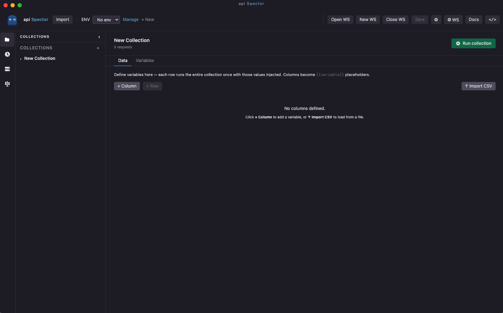
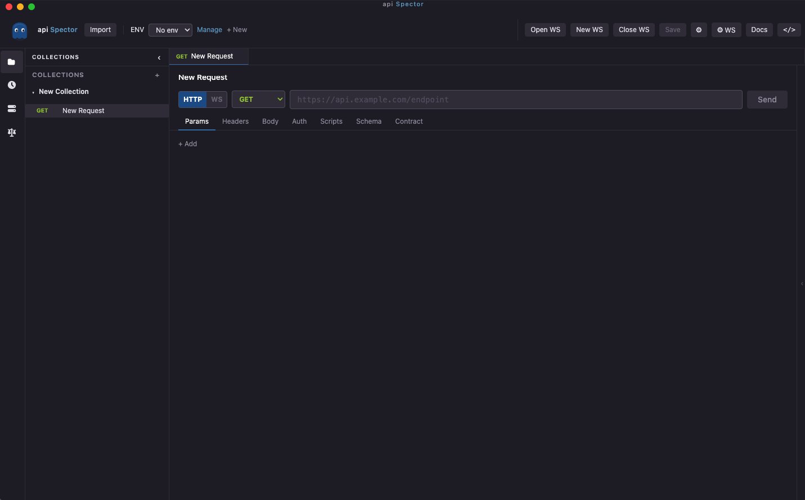
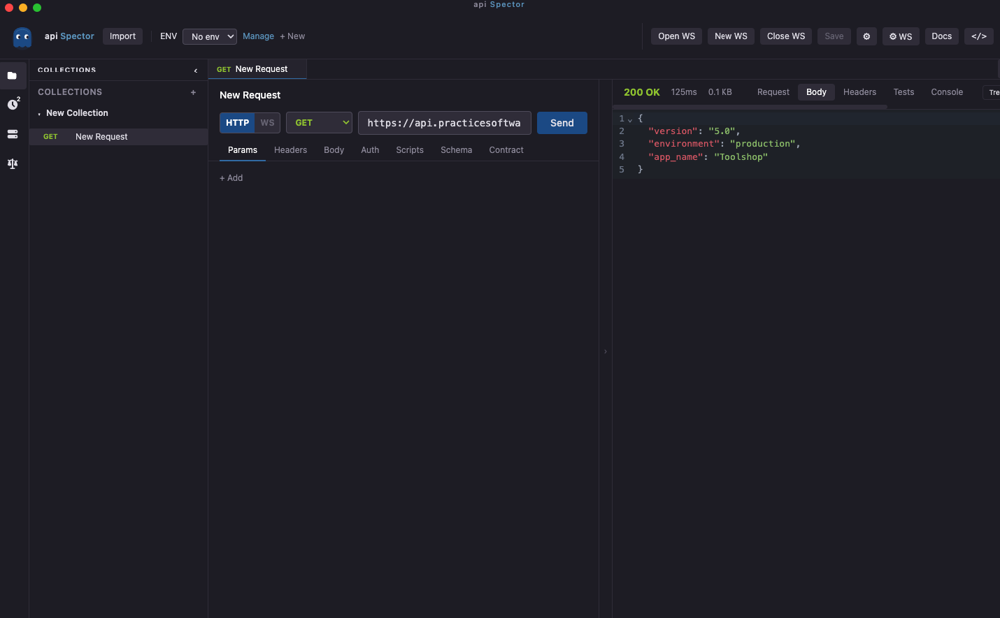

# Collections & Requests

A **collection** is a named group of API requests organised in folders. Collections are saved as `.spector` files next to your workspace.

## Create a collection

1. In the left sidebar, click **+ New Collection**
2. Enter a name and press Enter



The collection file is created automatically at `collections/<name>.spector` relative to the workspace.

## Rename or delete a collection

Double-click the collection name in the sidebar to rename it inline. Right-click for a context menu with rename and delete options.

Collection names must be unique within a workspace. If you enter a duplicate name, an error is shown inline and the rename is not committed.

## Create a folder

Folders help organise large collections. To create a folder:

1. Right-click a collection or an existing folder
2. Select **New Folder**
3. Enter a name

Folders can be nested. They can also carry their own **auth** and **headers** which are inherited by all requests inside them unless a request overrides them.

## Create a request

1. Right-click a folder (or the collection root)
2. Select **New Request**
3. A new tab opens with an untitled request



## Configure a request

### Method and URL

Select the HTTP method from the dropdown (GET, POST, PUT, PATCH, DELETE, HEAD, OPTIONS) and type the URL. Use `{{variable}}` syntax anywhere in the URL to reference environment or collection variables.

```
https://api.example.com/users/{{userId}}
```

### Params

Key/value query parameters. Enabled parameters are appended to the URL automatically. Disable a row without deleting it by unchecking the checkbox.

### Headers

Add request headers as key/value pairs. Headers from the parent folder are merged automatically — request-level headers take precedence.

### Body

| Mode | Description |
|---|---|
| None | No request body |
| JSON | JSON editor with syntax highlighting |
| Form | `application/x-www-form-urlencoded` key/value pairs |
| Raw | Plain text with a configurable Content-Type |
| GraphQL | Query, variables and optional operation name |
| SOAP | XML envelope editor with WSDL URL and SOAPAction |

### Auth

| Type | Description |
|---|---|
| None | No authentication |
| Bearer | Authorization: Bearer token |
| Basic | Username + password (Base64) |
| API Key | Key sent in header or query string |
| Digest | Two-round-trip digest authentication |
| NTLM | Windows NTLM authentication |
| OAuth 2.0 | Client credentials, authorization code, implicit, password flows |

Auth set on a **folder** is inherited by all requests in that folder. A request with auth type set to **None** will use the nearest parent folder's auth.

### Scripts

Two script hooks are available per request:

- **Pre-request** — runs before the request is sent
- **Post-response** — runs after the response is received, used for tests and assertions

See [Scripting API](../reference/scripting.md) for full reference.

### Schema

Paste a JSON Schema here to validate the response body automatically on each send.

## Send a request

Click **Send** or press `Enter` in the URL field. The response appears in the right panel.



## Import from OpenAPI

See [Import OpenAPI](../gui/import-openapi.md).
