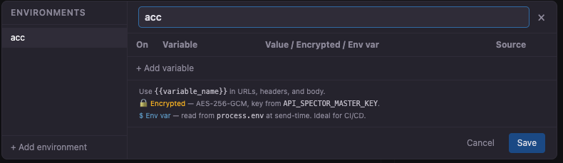
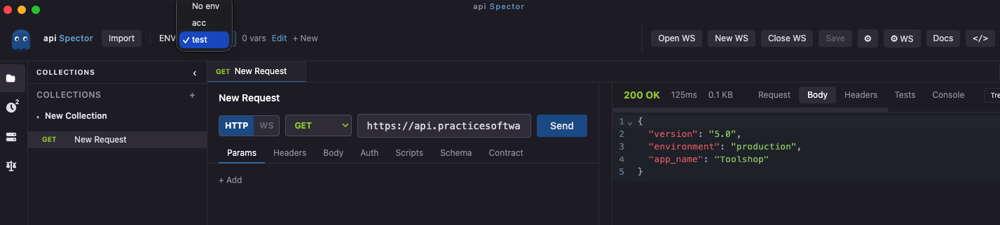
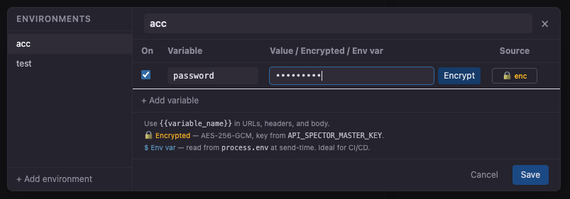
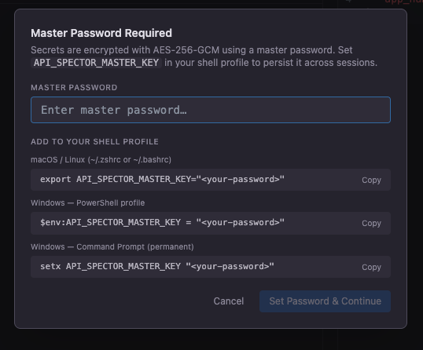

# Environments, Variables & Secrets

Environments hold key/value variables that are injected into requests at send time using `{{variableName}}` syntax.

## Create an environment

1. In the top bar, click **+ New** next to the environment selector
2. The environment editor opens automatically
3. Enter a name in the **Name** field
4. Add variables and click **Save**



Environment files are saved as `environments/<name>.env.json` relative to the workspace. Environment names must be unique within a workspace.

## Switch environments

Use the **Env** dropdown in the top bar to switch the active environment. All requests use the active environment's variables at send time.



## Variable types

### Plain text

Normal key/value pairs stored as-is in the `.env.json` file.

```
BASE_URL = https://api.example.com
API_VERSION = v2
```

### OS environment reference (`envRef`)

The value is read from an OS environment variable at send time, never stored on disk.

Set `envRef` to the name of an OS variable, e.g. `MY_API_TOKEN`. At send time, the main process reads `process.env.MY_API_TOKEN`.

### Encrypted secret

The value is encrypted with AES-256-GCM using a master password. The ciphertext is stored in the `.env.json` file; the plain text value never touches disk.

To create a secret:

1. Add a variable row and enable the **Secret** toggle
2. Type the plain text value in the input field
3. Click **Encrypt**: the master password modal appears if needed
4. Enter your master password and confirm



The stored file contains only: `secretEncrypted`, `secretSalt`, `secretIv`, and a short `secretHash` (first 8 hex chars of SHA-256 of the value, for display only, not reversible).

## Using variables in requests

Use double-brace syntax anywhere: URL, headers, body, query params, script values.

```
{{BASE_URL}}/{{API_VERSION}}/users
```

```json
{
  "token": "{{AUTH_TOKEN}}"
}
```

Variable resolution order (later wins):

| Scope | Description |
|---|---|
| Globals | Shared across all collections and environments |
| Collection variables | Scoped to one collection |
| Environment variables | Active environment |
| Local variables | Set by pre-request script, request-scoped only |

## Master password

Encrypted secrets require a master password to decrypt at send time.

**Option 1: Set in shell profile** (persists across sessions):

```bash
# ~/.zshrc or ~/.bashrc
export API_SPECTOR_MASTER_KEY="your-password"
```

Then launch the app or CLI from that terminal session.

**Option 2: Enter in the app** (per session):

When you select an environment that contains secrets and the master key is not set, a prompt appears automatically. The password is stored only in memory for the lifetime of the app process.



**For CI/CD**, set the variable as a pipeline secret:

```yaml
# GitHub Actions
env:
  API_SPECTOR_MASTER_KEY: ${{ secrets.API_SPECTOR_MASTER_KEY }}
```

If the master key is not set when sending a request, a `[warn]` message appears in the **Console** tab of the response viewer for each secret that could not be decrypted.

## Collection variables

Collection variables are stored directly inside the `.spector` collection file and are scoped to that collection. They can be read and written from scripts:

```js
sp.collectionVariables.set('token', 'abc123')
```

## Globals

Global variables are stored in `globals.json` in the workspace directory and are shared across all collections. They survive app restarts and can be written from scripts:

```js
sp.globals.set('sessionId', 'xyz')
```
