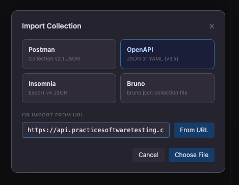
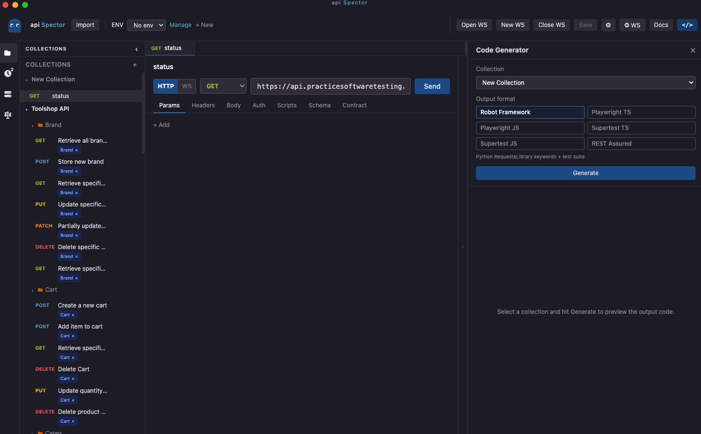

# Import OpenAPI

api Spector can import an OpenAPI 3.x specification and convert it into a collection.

## How to import

1. Open or create a workspace
2. In the top toolbar, click **Import**
3. Choose **OpenAPI / Swagger**
4. Select a file or enter a URL

## Supported input formats

| Format | Source |
|---|---|
| `.json` | Local file |
| `.yaml` / `.yml` | Local file |
| URL | Remote JSON or YAML spec fetched at import time |

OpenAPI 2.x (Swagger) is not supported. Use a converter like [swagger2openapi](https://github.com/Mermade/oas-tools) first.

## What gets imported

| OpenAPI element | Imported as |
|---|---|
| `info.title` | Collection name |
| `paths` + operations | One request per operation |
| `operationId` / `summary` | Request name |
| `tags` | Request tags and folder grouping |
| Path + query parameters | Params tab |
| Request body (`application/json`) | JSON body with example values |
| `securitySchemes` | Auth config (Bearer, API Key, Basic) |
| `servers[0].url` | Base URL on each request |

## After import

The imported collection appears in the sidebar. All requests are ready to send. Review and adjust:

- Replace example values with `{{variables}}` to use your environment
- Set auth credentials in the request or folder Auth tab
- Add pre/post scripts for tests or token extraction

