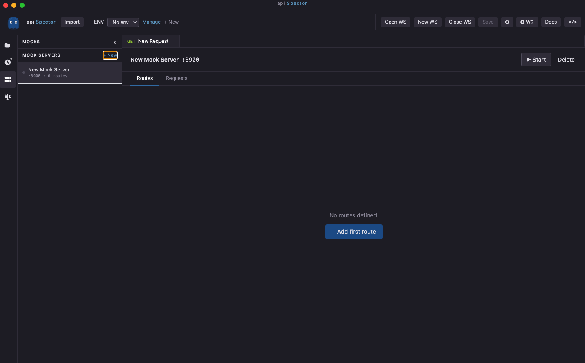
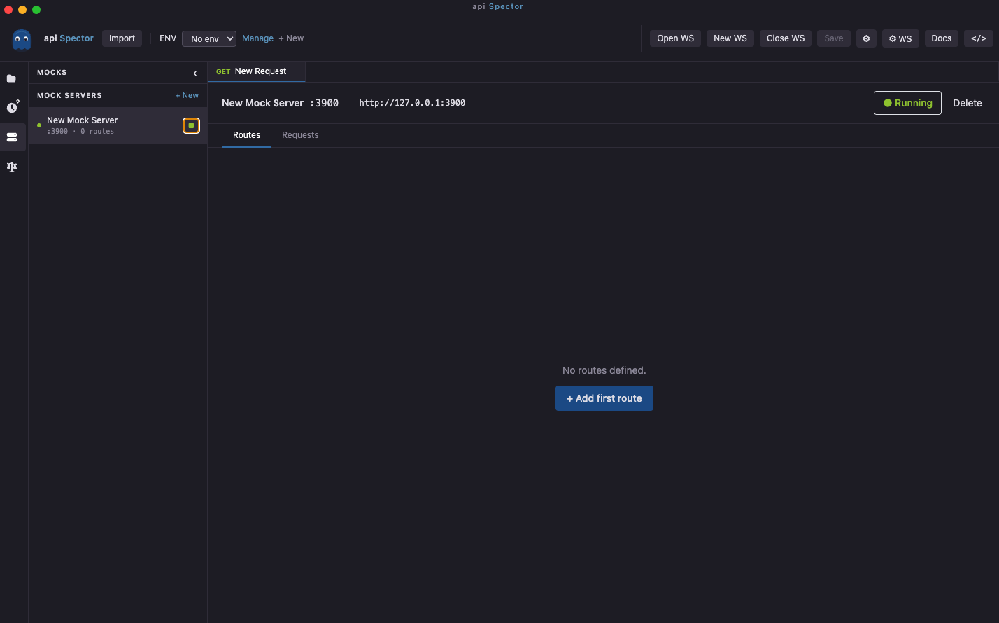
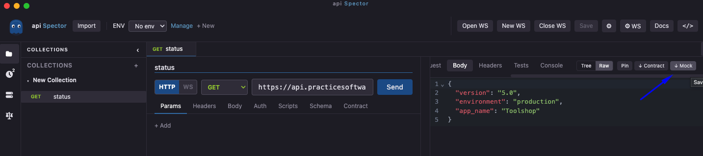

# Mock Servers

Mock servers let you simulate API endpoints without a real backend. Routes can return static JSON, dynamically generated data, or fully scripted responses that react to the incoming request.

## Create a mock server

1. In the left sidebar, click the **Mocks** tab
2. Click **+ New Mock**
3. Enter a name and port number
4. Add routes



## Configure routes

Each route has:

| Field | Description |
|---|---|
| Method | HTTP method or `ANY` to match all |
| Path | URL path, supports Express-style params like `/users/:id` |
| Status code | HTTP response status |
| Headers | Response headers as key/value pairs |
| Body | Response body — supports `{{expression}}` interpolation (see below) |
| Delay | Optional delay in ms before responding |
| Description | Optional note |
| Pre-response script | JavaScript that runs before the response is sent (see below) |

## Start and stop

Toggle the **Start / Stop** button in the mock server panel. When running, the server listens on `http://127.0.0.1:<port>`.



## Request log

The **Requests** tab shows every incoming hit with method, path, matched route, status code, and response time. Click any row to expand and inspect the response headers and body that were sent.

---

## Dynamic response bodies

Use `{{expression}}` tokens in the response body to generate data at request time. Every token is evaluated as a JavaScript expression with access to the incoming request, Faker.js, and Day.js.

### Request data

Access values from the incoming request directly in the body:

| Token | Description | Example value |
|---|---|---|
| `{{request.params.id}}` | URL path parameter `:id` | `"42"` |
| `{{request.query.search}}` | Query string parameter `search` | `"laptop"` |
| `{{request.body.email}}` | JSON request body field | `"user@example.com"` |
| `{{request.method}}` | HTTP method | `"POST"` |
| `{{request.path}}` | Request URL path | `"/products/42"` |
| `{{request.headers.authorization}}` | Request header value | `"Bearer abc…"` |

**Example** — route `/products/:id`, response body:

```json
{
  "id": {{request.params.id}},
  "name": "Product {{request.params.id}}",
  "requestedBy": "{{request.query.user}}"
}
```

A `GET /products/7?user=alice` call returns:

```json
{
  "id": 7,
  "name": "Product 7",
  "requestedBy": "alice"
}
```

### Faker.js

Generate realistic random data using [Faker.js](https://fakerjs.dev/):

```json
{
  "id":        "{{faker.string.uuid()}}",
  "firstName": "{{faker.person.firstName()}}",
  "lastName":  "{{faker.person.lastName()}}",
  "email":     "{{faker.internet.email()}}",
  "iban":      "{{faker.finance.iban()}}",
  "city":      "{{faker.location.city()}}"
}
```

See [Faker reference](../reference/faker.md) for all available methods.

### Day.js

Generate date/time values using [Day.js](https://day.js.org/):

```json
{
  "createdAt": "{{dayjs().toISOString()}}",
  "date":      "{{dayjs().format('YYYY-MM-DD')}}",
  "ts":        "{{dayjs().valueOf()}}"
}
```

---

## Pre-response scripts

Add a **Pre-response script** to a route to run JavaScript before the response is sent. Use this to build conditional responses, compute values, or branch on request content.

The script has access to:

| Variable | Description |
|---|---|
| `request` | Incoming request (read-only) |
| `response` | Outgoing response draft — mutate to change what is sent |
| `faker` | Faker.js instance |
| `dayjs` | Day.js |
| `console.log(...)` | Logs to the main-process console |

### `request` object

| Property | Type | Description |
|---|---|---|
| `request.method` | `string` | HTTP method (`"GET"`, `"POST"`, …) |
| `request.path` | `string` | URL path |
| `request.params` | `object` | Path parameters extracted from the route pattern |
| `request.query` | `object` | Query string parameters |
| `request.body` | `object` | Parsed JSON body (or `{}` if not JSON) |
| `request.bodyRaw` | `string` | Raw request body string |
| `request.headers` | `object` | Request headers |

### `response` object

Mutate these properties to change the response that is sent:

| Property | Type | Description |
|---|---|---|
| `response.statusCode` | `number` | HTTP status code |
| `response.body` | `string` | Response body string |
| `response.headers` | `object` | Response headers |

### Examples

**Return 404 when an ID is unknown:**

```js
const knownIds = ['1', '2', '3']
if (!knownIds.includes(request.params.id)) {
  response.statusCode = 404
  response.body = JSON.stringify({ error: 'Not found', id: request.params.id })
}
```

**Echo the request body back:**

```js
response.body = JSON.stringify({
  received: request.body,
  processedAt: dayjs().toISOString()
})
```

**Return different data based on a query parameter:**

```js
const count = parseInt(request.query.count) || 3
const items = Array.from({ length: count }, (_, i) => ({
  id: i + 1,
  name: faker.commerce.productName(),
  price: faker.commerce.price()
}))
response.body = JSON.stringify(items)
```

> **Note:** `{{expression}}` tokens in the body are expanded *after* the script runs, so you can set `response.body` to a template string and still use tokens in it.

---

## Traffic recorder

The recorder sits between your application and a real API, captures every request/response pair, and turns them into mock routes — so you can replay them offline without hitting the real service.

### Start recording

1. In the **Mocks** sidebar, expand the **Recorder** section
2. Enter the **Upstream URL** (the real API your app talks to, e.g. `https://api.example.com`)
3. Set a **Local port** (default 8787) — point your app at `http://localhost:<port>` instead of the real API
4. Click **⏺ Start recording**

The recorder proxies every request to the upstream and stores the full request/response pair.

> `/favicon.ico` requests are silently ignored and never recorded.

### Stop and import

1. Click **■ Stop** in the recorder panel header
2. Review the captured requests in the list — click any row to inspect headers and bodies
3. Choose a destination from the **Import to** dropdown:
   - **New mock server** — creates a fresh server pre-populated with the recorded routes
   - An existing mock server — appends the new routes to it
4. Click **⧉ Import**

### Deduplication

When the same endpoint (`METHOD + path`) appears multiple times in a recording, only one route is created:

- The **first successful (2xx) response** is used
- If no 2xx response was recorded for that endpoint, the last recorded response is used

When importing into an **existing** mock server, routes whose `METHOD + path` already exist are **skipped** — existing routes are never overwritten.

### CLI recorder

See [Mock Servers CLI](../cli/mock.md) for running the recorder headlessly and saving `.recording.json` / `.mock.json` files directly from the terminal.

---

## Save a response as a mock route

After sending a real request, capture the response as a mock route from the **Response Viewer**:

1. Send a request and view the response
2. Click **↓ Mock** in the response panel toolbar
3. Choose an existing mock server or create a new one
4. Adjust the path, method, and status code
5. Click **Add route**



## Run from CLI

See [Mock Servers CLI](../cli/mock.md).

## Route matching

- Routes are evaluated in order; the first match wins
- `ANY` matches all HTTP methods
- Path parameters (`:id`) are captured and available as `request.params.id`
- Unmatched requests return `404`
