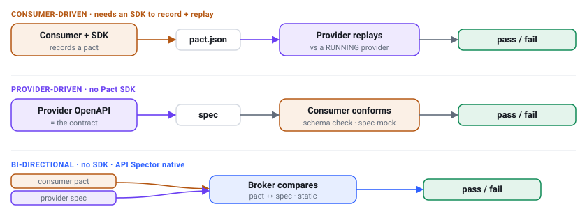
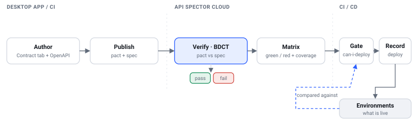
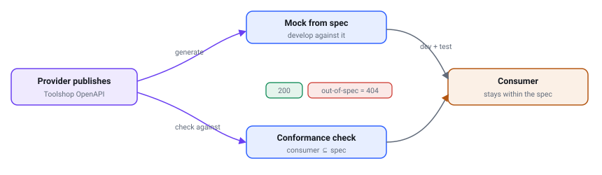
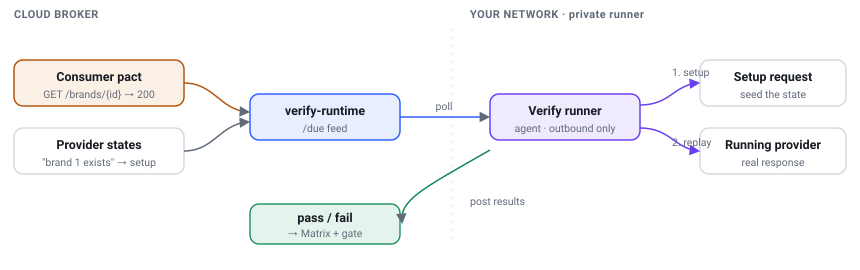

# Contract testing workflows

End-to-end workflows for **all three contract-testing variants** — consumer-driven,
provider-driven, and bi-directional — with and without the cloud. Every example
uses the real **[Toolshop API](https://api.practicesoftwaretesting.com/api/documentation)**
(`practicesoftwaretesting.com`): a `toolshop-web` frontend (the **consumer**)
calls `toolshop-api` (the **provider**), starting with `GET /brands/{brandId}`.

## The three variants at a glance



| Variant | Who authors the contract | How it's checked | SDK? | API Spector |
| --- | --- | --- | --- | --- |
| **Bi-directional (BDCT)** | both, independently | broker compares pact ↔ spec, statically | no | **native** |
| **Provider-driven (PDCT)** | provider (OpenAPI) | consumers *conform* to the spec (schema / spec-mock) | no | conformance + mock-from-spec |
| **Consumer-driven (CDCT)** | consumer (a pact) | provider *replays* the pact against a running provider | SDK, or the private runner | replay on the private runner |

**Pick BDCT unless you have a reason not to** — it needs only the two documents
you already have (a pact from your requests, the provider's OpenAPI), and no one
runs the other's code. Reach for **PDCT** when consumers just need to stay within
a published spec, and **CDCT** when you want runtime proof the *live* provider
satisfies real consumer expectations.

> Each variant works **with the cloud broker or fully locally** — see
> [With and without the cloud](#with-and-without-the-cloud).

## Setup (cloud path)

Create an API token in the cloud dashboard (**Tokens**), then in your shell:

```bash
export API_SPECTOR_TOKEN='17|…your-token…'
# only for a self-hosted / local stack:
export API_SPECTOR_CLOUD_ENDPOINT='http://localhost:8899'
```

The CLI keys every publish/gate to the **git SHA** automatically (`GITHUB_SHA` →
`git rev-parse HEAD`); pass `--version <sha>` to override.

---

## Variant A — Bi-directional (BDCT)

The provider publishes its OpenAPI, each consumer publishes a pact, and the
broker compares the two **without running anything**.



### 1. Author (desktop app)

- The `toolshop-api` team already has the OpenAPI at
  `https://api.practicesoftwaretesting.com/docs?api-docs.json`.
- The `toolshop-web` team builds the request it makes and, on the request's
  **Contract** tab, declares what it relies on:
  - **Expected status** `200`
  - **Body shape** — `id`, `name`, `slug` are present (types, not values).

### 2. Publish (from CI, keyed to the commit)

```bash
# provider CI — publish the spec on every merge
api-spector contract publish-spec \
  --provider toolshop-api \
  --spec-url "https://api.practicesoftwaretesting.com/docs?api-docs.json"

# consumer CI — publish the pact built from your Contract-tab expectations
api-spector contract publish \
  --workspace ./toolshop.spector \
  --consumer toolshop-web --provider toolshop-api
```

On either publish the cloud runs **`BdctVerifier`**: for each pact interaction it
checks the spec defines the path + method and that the response status/schema are
compatible, and writes a pass/fail **verification**.

### 3. See it — the Matrix

Open **Matrix** in the cloud. `toolshop-web → toolshop-api` is **green**, and the
**Coverage** panel shows which `toolshop-api` endpoints a consumer actually
depends on (`GET /brands/{brandId}` covered; the rest simply unverified).

### 4. Gate the deploy (CI)

```bash
# fails the pipeline (exit 1 / HTTP 409) if the change would break a live consumer
api-spector contract deploy-check --broker \
  --pacticipant toolshop-api --environment production
```

> **Naming:** `deploy-check` is API Spector's name for the gate. `can-i-deploy`
> is a Pact-compatible **alias** (same command), and the broker endpoint stays
> `/can-i-deploy` — so existing Pact CLI/clients work against the broker unchanged.

Prefer a **comment over a 409** on pull requests:

```bash
api-spector contract preview \
  --pacticipant toolshop-api --environment production
# prints: "toolshop-api@a1b2c3 would break production — toolshop-web needs GET /brands/{brandId}"
```

### 5. Record the deploy

```bash
api-spector contract record-deployment --broker \
  --pacticipant toolshop-api --environment production
```

That updates **Environments** so the next gate compares against what's really
live. Environments are created automatically the first time you record a
deployment to them — there is no "create environment" step.

### What it catches

`toolshop-api v2` drops `name` from the brand schema (or removes the path). The
broker re-checks `toolshop-web`'s pact against v2 statically → **red on the
Matrix**, `deploy-check` → **409**, and if a webhook is configured the affected
consumer team is **notified at publish time**.

---

## Variant B — Provider-driven (PDCT)

The provider's OpenAPI *is* the contract; consumers make sure they stay inside it,
and can develop against a mock generated from it.



### 1. Provider publishes the spec

```bash
api-spector contract publish-spec \
  --provider toolshop-api \
  --spec-url "https://api.practicesoftwaretesting.com/docs?api-docs.json"
```

### 2a. Consumer develops against a spec-mock

```bash
# build a mock from the provider's latest published spec
curl -X POST "$API_SPECTOR_CLOUD_ENDPOINT/api/mocks/from-spec/toolshop-api" \
  -H "Authorization: Bearer $API_SPECTOR_TOKEN"
# → a mock serving GET /brands/:id → 200 { "id": "...", "name": "string", "slug": "string" }
```

A call the spec doesn't define **404s** — the non-conformance signal, before you
ever touch the real service.

### 2b. Consumer checks conformance in CI

```bash
# does toolshop-web's usage stay within toolshop-api's spec? 200 = yes, 422 = no
curl -f -X POST "$API_SPECTOR_CLOUD_ENDPOINT/api/conformance" \
  -H "Authorization: Bearer $API_SPECTOR_TOKEN" -H 'Content-Type: application/json' \
  -d '{ "provider": "toolshop-api",
        "content": { "interactions": [
          { "description": "list brands", "request": { "method": "GET", "path": "/brands" },
            "response": { "status": 200 } } ] } }'
```

If `toolshop-web` starts calling `GET /brands?discontinued=true` — a filter the
spec never declares — conformance returns **422** and CI fails.

---

## Variant C — Consumer-driven (CDCT)

The consumer's pact is the contract, and the provider **replays** it against a
*running* provider — real runtime proof. API Spector runs this on the **private
runner** (no third-party SDK), and handles the data each interaction assumes via
**provider states**.



### 1. Publish the consumer pact (as in BDCT)

```bash
api-spector contract publish --workspace ./toolshop.spector \
  --consumer toolshop-web --provider toolshop-api
```

### 2. Register the provider states

An interaction like *"brand 1 exists"* needs data set up first. Register a **setup
request** per state — run against the provider's own API, never the database:

```bash
curl -X PUT "$API_SPECTOR_CLOUD_ENDPOINT/api/provider-states/toolshop-api" \
  -H "Authorization: Bearer $API_SPECTOR_TOKEN" -H 'Content-Type: application/json' \
  -d '{ "states": {
          "brand 1 exists": { "method": "POST", "url": "/brands",
                              "body": { "mode": "json", "json": "{\"name\":\"Seed\",\"slug\":\"seed\"}" } } } }'
```

### 3. Register the verify job (where the provider runs)

```bash
curl -X PUT "$API_SPECTOR_CLOUD_ENDPOINT/api/verify-jobs" \
  -H "Authorization: Bearer $API_SPECTOR_TOKEN" -H 'Content-Type: application/json' \
  -d '{ "provider": "toolshop-api", "version": "v5",
        "base_url": "https://api.practicesoftwaretesting.com" }'
```

### 4. Run the verify runner (inside your network)

The runner is the private-runner agent with a token carrying the **`verify`**
ability. It polls the feed, runs each interaction's state setup, replays the
request against `base_url`, compares the real response to the pact (Postel: the
response must contain *at least* what the pact expects), and posts pass/fail:

```bash
docker run -d --name api-spector-verify --restart unless-stopped \
  -e APP_URL="$API_SPECTOR_CLOUD_ENDPOINT" \
  -e AGENT_TOKEN='<token with the verify ability>' \
  testsmith/api-spector-agent:latest node /runtime/verify/serve.mjs
```

Results land on the same **Matrix** and feed the same `deploy-check` gate.

### What it catches (that BDCT can't)

`toolshop-api` is deployed and, despite what its spec *claims*, actually returns
`title` instead of `name`. Replay hits the running service and fails:
`$.name: missing in response` — the **deployed** provider drifting from a real
consumer expectation.

---

## With and without the cloud

Every variant has a fully **local** path — the local engine has zero cloud
dependencies and stores results as files in the workspace (git-committable).

| | Local (no cloud) | Cloud (broker) |
| --- | --- | --- |
| Author | Contract tab · pinned spec snapshot | same |
| Verify | `contract run --mode bidirectional \| consumer \| provider \| provider-live` | broker BDCT on publish |
| Gate | file-based `deploy-check` in `<workspace>/contracts/` | `deploy-check --broker` |
| Shared across teams / "what's live in prod" | no (per-workspace) | yes (Matrix, Environments) |

Local BDCT for the same example:

```bash
# pin the provider spec, run bidirectional locally, record for the local gate
api-spector contract run --workspace ./toolshop.spector --mode bidirectional \
  --spec-url "https://api.practicesoftwaretesting.com/docs?api-docs.json" \
  --record --pacticipant toolshop-web --app-version "$(git rev-parse HEAD)"

api-spector contract deploy-check --workspace ./toolshop.spector \
  --pacticipant toolshop-web --to production
```

The **same artifacts** (Contract-tab expectations, pact, OpenAPI) feed both — you
author once and choose per command whether to run locally or publish.

## CI

A ready-to-copy GitHub Actions workflow (publish → gate → record, plus a PR
comment) is in [`docs/ci/contract-testing.yml`](../ci/contract-testing.yml).

## Command reference

| Purpose | Command |
| --- | --- |
| Publish consumer pact | `contract publish --workspace <ws> --consumer <c> --provider <p>` |
| Derive pact from saved example responses | `contract publish … --derive` |
| Publish provider spec | `contract publish-spec --provider <p> --spec-url\|--spec <s>` |
| Gate (fails pipeline) | `contract deploy-check --broker --pacticipant <x> --environment <e>` |
| PR-friendly preview | `contract preview --pacticipant <x> --environment <e>` |
| Record a deployment | `contract record-deployment --broker --pacticipant <x> --environment <e>` |
| Conformance (PDCT) | `POST /api/conformance` |
| Mock from spec (PDCT) | `POST /api/mocks/from-spec/{provider}` |
| Register verify job / states (CDCT) | `PUT /api/verify-jobs` · `PUT /api/provider-states/{provider}` |
| Local run (no cloud) | `contract run --mode bidirectional\|consumer\|provider\|provider-live` |

See also: [Contract Testing (GUI)](../gui/contract-testing.md) ·
[Contract Testing (CLI)](../cli/contract-testing.md) ·
[Contract Testing Types](contract-testing-types.md) ·
[Pact Compatibility & Matchers](pact-compatibility.md).
